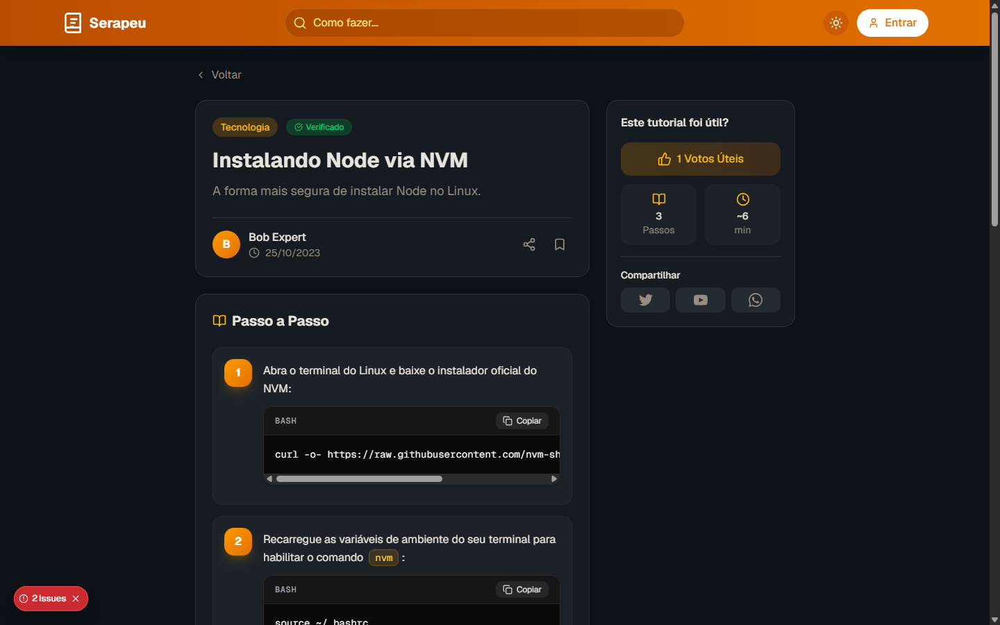
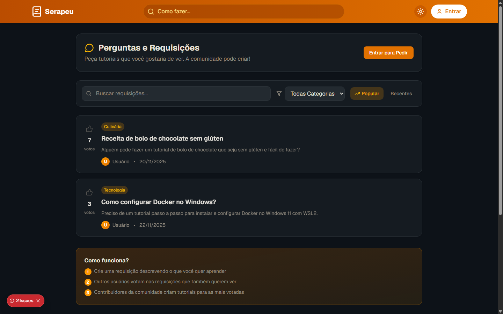
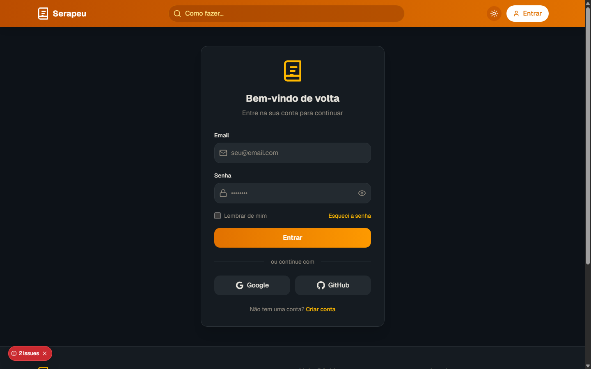

# 📚 Serapeu — Plataforma Colaborativa de Tutoriais

<p align="center">
  
</p>

<p align="center">
  <b>Uma plataforma moderna de compartilhamento de conhecimento prático passo a passo, projetada com foco em performance, segurança OWASP, integridade concorrente e experiência do desenvolvedor.</b>
</p>

<p align="center">
  
  
  
  
  
  
  
</p>

---

## 📸 Galeria do Projeto

Uma experiência de usuário fluida, responsiva e com suporte nativo a tema claro e escuro.

### 1. Leitura de Tutoriais com Blocos de Código & Cópia com 1 Clique
Visualização moderna de passos técnicos com realce de sintaxe em terminal dark, badges de comandos inline e botão de copiar integrado.
<p align="center">
  
</p>

### 2. Hub da Comunidade: Perguntas, Requisições & Votação
Espaço onde a comunidade solicita tutoriais com ordenação por popularidade ou recência, e contadores atômicos de upvotes.
<p align="center">
  
</p>

### 3. Autenticação Segura (Email, Senha & OAuth)
Fluxo de autenticação baseado em cookies seguros HTTP-only gerenciados no servidor via `@supabase/ssr`.
<p align="center">
  
</p>

### 4. Página Institucional & Manifesto
Apresentação da missão da plataforma com design limpo e tipografia harmoniosa.
<p align="center">
  
</p>

---

## 💎 Destaques de Arquitetura & Engenharia de Software

O Serapeu foi submetido a uma auditoria técnica profunda de nível sênior, resultando em uma plataforma blindada contra falhas estruturais clássicas:

### 🔒 1. Segurança & Hardening (OWASP Top 10)
- **Sessões HTTP-Only com `@supabase/ssr`:** Eliminação completa da persistência de tokens sensíveis no `localStorage`, mitigando vetores de ataque XSS contra tokens JWT.
- **Proteção contra Open Redirect (CWE-601):** Validação estrita de rotas de retorno em `/auth/callback` e `/auth/signout`, impedindo redirecionamentos para domínios maliciosos externos.
- **Role-Based Access Control (RBAC) no Banco:** Trigger PostgreSQL `protect_profile_roles` em nível de banco que bloqueia qualquer tentativa client-side de auto-promoção para `ADMIN`.
- **Enforcement Imediato de Suspensão:** Endpoint `/api/auth/me` responde com `HTTP 403 Forbidden` quando a conta está banida, acionando expiração da sessão do cliente e redirecionamento para `/acesso-negado`.
- **Prevenção de Auto-Bloqueio de Administradores:** Guardas que impedem administradores de rebaixar, banir ou excluir acidentalmente suas próprias contas.

### ⚡ 2. Consistência Concorrente & Zero Race Conditions
- **Normalização de Votos:** Substituição do anti-pattern de array `upvoted_by UUID[]` por uma tabela relacional dedicada `tutorial_request_votes` com chave primária composta `(request_id, user_id)`.
- **Triggers PostgreSQL Atômicos:** Triggers de banco que incrementam ou decrementam os contadores de voto atomicamente no banco (`+1` / `-1`), eliminando sobrescritas concorrentes sob alto volume de acessos.

### 🛡️ 3. Resiliência de Dados & Soft Deletes
- **Preservação de Conteúdo Histórico:** Exclusão de tutoriais e comentários adota soft-delete via coluna `deleted_at`, mantendo integridade referencial.
- **Anonimização de Autores:** Usuários removidos têm seus dados pessoais anonimizados (`"[Usuário Removido]"`), impedindo a destruição em cascata (*CASCADE DELETE*) de tutoriais e respostas de valor público criadas por aquele autor.

### 🚦 4. Anti-Spam & Rate Limiting Híbrido
- **Algoritmo Sliding Window Log (`lib/ratelimit.ts`):** Motor de limitação de taxa em memória com limpeza periódica para evitar vazamentos de memória (*memory leaks*), e preparado para integração com Upstash Redis.
- **Limites Aplicados:**
  - **Criação de Tutoriais:** Máximo de 5 por hora por usuário/IP.
  - **Comentários:** Trava anti-flood de 1 a cada 10 segundos por usuário.
  - **Pedidos:** Máximo de 10 requisições por 10 minutos.
  - **Respostas:** `HTTP 429 Too Many Requests` com cabeçalhos padrão `Retry-After` e `X-RateLimit-*`.

### 🧠 5. Moderação Inteligente & Sanitização Universal
- **Motor de Moderação (`lib/moderation.ts`):** Verificação preventiva de domínios maliciosos de phishing (ex: `grabify.link`, `iplogger`), detecção de termos de ódio/ilícitos e bloqueio de spam por repetição ou excesso de links externos.
- **Sanitização XSS (`lib/sanitize.ts`):** Sanitização estrita de tags HTML maliciosas em todos os payloads antes da persistência no banco.
- **Validação com Zod (`lib/validations/`):** Schemas tipados e centralizados para todas as operações da API.

### 📊 6. Observabilidade & DevOps CI/CD
- **GitHub Actions CI (`.github/workflows/ci.yml`):** Pipeline automático rodando a cada `push` e Pull Request com checagem de tipos estrita (`npx tsc --noEmit`), suíte de testes Vitest e build de produção Next.js.
- **Endpoint de Diagnóstico (`/api/health`):** Verificação de conectividade e medição de latência em milissegundos com o banco de dados.
- **Logger Estruturado (`lib/logger.ts`):** Formato JSON em produção com mascaramento automático de credenciais e dados sensíveis (senhas, tokens, cookies).

---

## 🛠️ Stack Tecnológica

| Camada | Tecnologia |
| :--- | :--- |
| **Framework Full-Stack** | [Next.js 16](https://nextjs.org/) (App Router, Turbopack, React 19) |
| **Linguagem** | [TypeScript 5](https://www.typescriptlang.org/) (Strict Mode) |
| **Banco de Dados & Auth** | [Supabase](https://supabase.com/) (PostgreSQL 15+, RLS Policies, SSR Cookies) |
| **Estilização & Design** | [Tailwind CSS](https://tailwindcss.com/) + [Radix UI](https://www.radix-ui.com/) + [Lucide Icons](https://lucide.dev/) |
| **Gestão de Tema** | [next-themes](https://github.com/pacocoursey/next-themes) (Light / Dark mode desacoplado) |
| **Validação de Dados** | [Zod](https://zod.dev/) |
| **Testes Automatizados** | [Vitest](https://vitest.dev/) (21 testes unitários) |
| **Integração Contínua** | [GitHub Actions](https://github.com/features/actions) |

---

## 🧪 Suíte de Testes Automatizados

O projeto possui cobertura de testes unitários focada em segurança, anti-spam, moderação e validação de contratos de API:

```bash
npm test
```

```text
 ✓ tests/unit/security-and-validations.test.ts (12 tests) 9ms
   ✓ Schemas Zod de Comentários
   ✓ Schemas Zod de Criação de Tutoriais
   ✓ Sanitização de Textos contra XSS
   ✓ Redação de Dados Sensíveis no Logger Estruturado

 ✓ tests/unit/ratelimit-and-moderation.test.ts (9 tests) 8ms
   ✓ Rate Limiter Sliding Window (limites, bloqueio e reset)
   ✓ Resposta HTTP 429 e cabeçalhos Retry-After
   ✓ Moderação contra domínios de phishing e IP-grabbers
   ✓ Moderação contra linguagem abusiva e spam de links

 Test Files  2 passed (2)
      Tests  21 passed (21)
   Duration  301ms
```

---

## 🚀 Como Executar o Projeto Localmente

### 1. Clonar o Repositório e Instalar Dependências
```bash
git clone https://github.com/ryuclover/Serapeu.git
cd Serapeu
npm ci
```

### 2. Configurar as Variáveis de Ambiente
Crie um arquivo `.env.local` na raiz com base no `.env.example`:
```env
NEXT_PUBLIC_SUPABASE_URL=https://seu-projeto.supabase.co
NEXT_PUBLIC_SUPABASE_ANON_KEY=sua-anon-key-aqui
SUPABASE_SERVICE_ROLE_KEY=sua-service-role-key-aqui
```

> **Nota para Recrutadores / Avaliação Local:** O projeto possui um mecanismo inteligente de *fallback gracioso*. Caso as variáveis do Supabase não estejam preenchidas, a aplicação carrega dados demonstrativos completos e permite navegar por todas as telas sem quebrar!

### 3. Executar as Migrations no Supabase
No SQL Editor do seu projeto Supabase, execute os arquivos da pasta `supabase/migrations/`:
1. `supabase/migrations/0001_initial_schema.sql` (Tabelas, RLS e Triggers de role)
2. `supabase/migrations/0002_normalize_votes_and_soft_deletes.sql` (Votos normalizados e Soft-delete)

### 4. Iniciar o Servidor de Desenvolvimento
```bash
npm run dev
```
Acesse a aplicação em `http://localhost:3000`.

---

## 📂 Estrutura de Pastas

```text
├── .github/workflows/       # Pipeline de CI/CD do GitHub Actions
├── app/                     # App Router do Next.js 16
│   ├── (rotas públicas)     # /, /perguntas, /criar, /sobre, /regras
│   ├── admin/               # Dashboard administrativo completo
│   ├── api/                 # Endpoints REST protegidos
│   │   ├── admin/           # Gestão de tutoriais, usuários e denúncias
│   │   ├── auth/            # Sessão atual e validação de banimento
│   │   ├── comments/        # Criação, edição e exclusão de comentários
│   │   ├── health/          # Health check público e diagnóstico
│   │   ├── requests/        # Pedidos com rate limit e moderação
│   │   ├── tutorials/       # CRUD com paginação e busca segura
│   │   └── users/           # Perfis públicos
│   └── tutorial/[id]/       # Página de tutorial com passos em código
├── components/              # Componentes de interface reutilizáveis
│   ├── step-content.tsx     # Renderizador de código com botão de cópia
│   ├── theme-provider.tsx   # Provedor do next-themes
│   └── ui/                  # Componentes base Radix UI
├── lib/                     # Núcleo da arquitetura
│   ├── logger.ts            # Logger estruturado com mascaramento PII
│   ├── moderation.ts        # Motor de moderação anti-phishing/abuso
│   ├── ratelimit.ts         # Motor Sliding Window de Rate Limiting
│   ├── sanitize.ts          # Sanitizador anti-XSS
│   ├── supabase/            # Clientes SSR, client e server helpers
│   └── validations/         # Schemas Zod universais
├── public/screenshots/      # Screenshots em alta definição do projeto
├── supabase/migrations/     # Migrations SQL versionadas
└── tests/unit/              # Suíte de testes automatizados com Vitest
```

---

## 📜 Licença

Distribuído sob a licença MIT. Consulte `LICENSE` para mais detalhes.

---

<p align="center">
  Desenvolvido com foco em excelência técnica, código limpo e arquitetura profissional.
</p>
